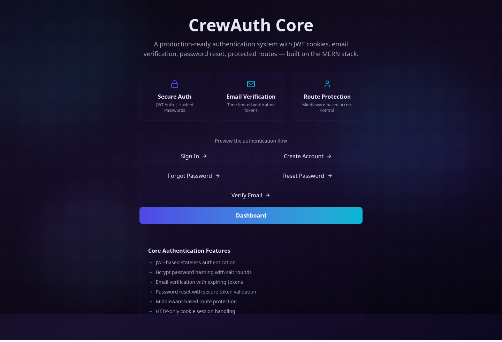
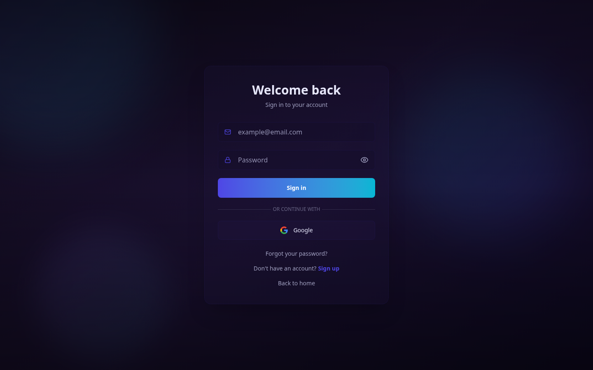
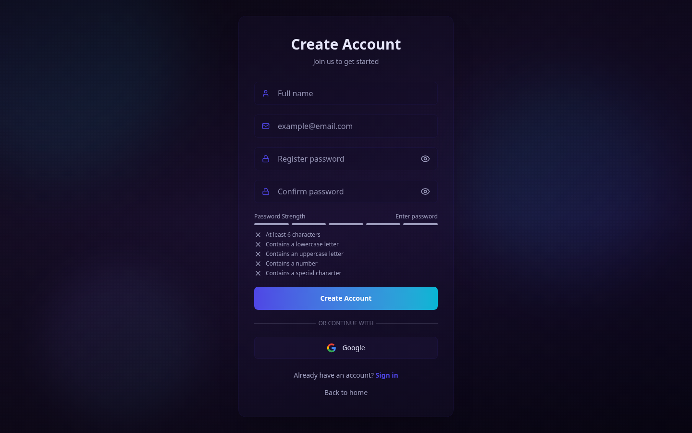
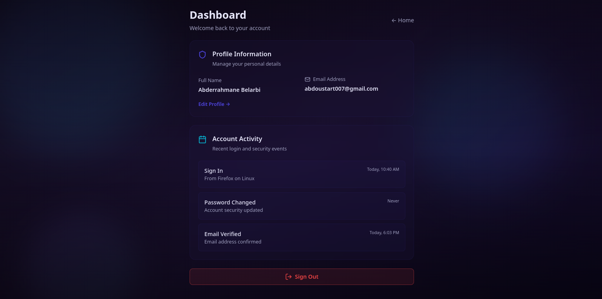
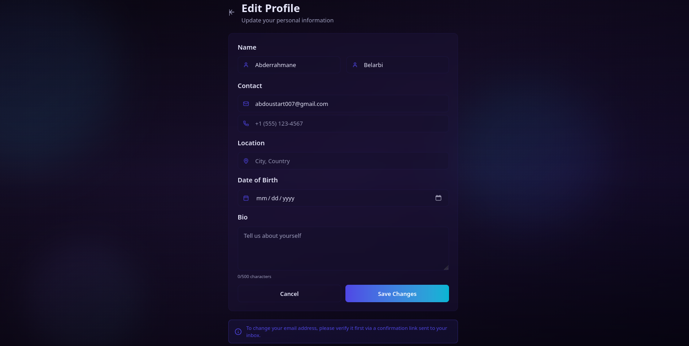
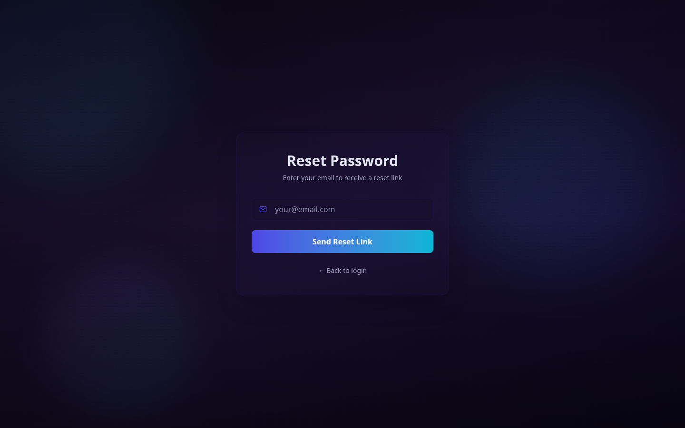
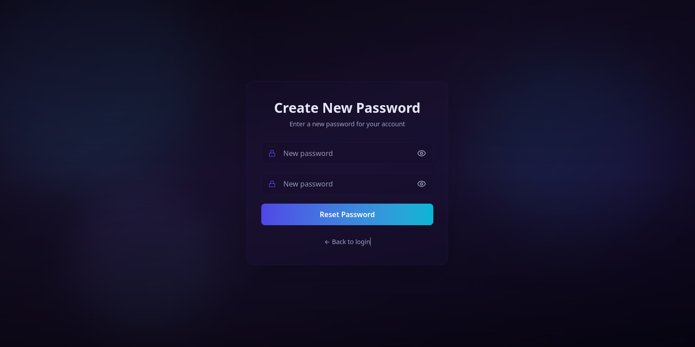

# CrewAuth 🔐

CrewAuth is a production-style full-stack authentication system built with the MERN ecosystem.  
It provides secure, modern account flows including email/password auth, Google OAuth, email verification, password reset, protected sessions, and profile management.

---

## Screenshots

### Home Page


### Login Page


### Signup Page


### Dashboard


### Edit Profile Page


### Dashboard


### Dashboard


## 📌 Overview

This project is designed to demonstrate real-world authentication patterns beyond simple login forms:

- cookie-based JWT sessions
- account verification and recovery by email
- OAuth with CSRF state protection
- authentication metadata tracking (IP, browser, OS, device)
- route guarding and session restoration in the frontend

CrewAuth is suitable as:

- a portfolio project
- a starter auth template for SaaS products
- a reference implementation for secure MERN authentication flows

---

## ✨ Features

### Authentication
- User registration with hashed passwords (`bcrypt`)
- Email verification via one-time code
- Resend verification code with cooldown
- Login/logout with JWT in `httpOnly` cookie
- Forgot password with expiring reset link
- Reset password using hashed token validation
- Google OAuth login/signup

### Security & Reliability
- JWT-protected private routes via middleware
- `httpOnly` cookie sessions with `sameSite` and production `secure` flag
- OAuth `state` cookie for CSRF mitigation
- Generic forgot-password response to reduce account enumeration risk
- Password reset token stored hashed in database

### User Experience
- Frontend route protection and redirect logic
- Session check on app startup
- Validation utilities (including password criteria)
- Profile editing endpoint and UI
- Modern animated UI components

---

## 🧱 Tech Stack

### Frontend
- React 19 + Vite
- React Router
- Zustand (state management)
- Tailwind CSS 4
- Framer Motion
- Zod validation

### Backend
- Node.js + Express 5
- MongoDB + Mongoose
- JWT + cookie-parser + CORS
- bcryptjs
- Google Auth Library + Google APIs (OAuth + Gmail API mail sending)
- UA Parser JS (auth metadata)

---

## 📁 Project Structure

```txt
.
├── backend/
│   ├── config/
│   ├── controllers/
│   ├── database/
│   ├── middleware/
│   ├── models/
│   ├── routes/
│   └── utils/
├── frontend/
│   ├── components/
│   ├── lib/
│   ├── pages/
│   ├── src/
│   └── store/
├── package.json
└── README.md